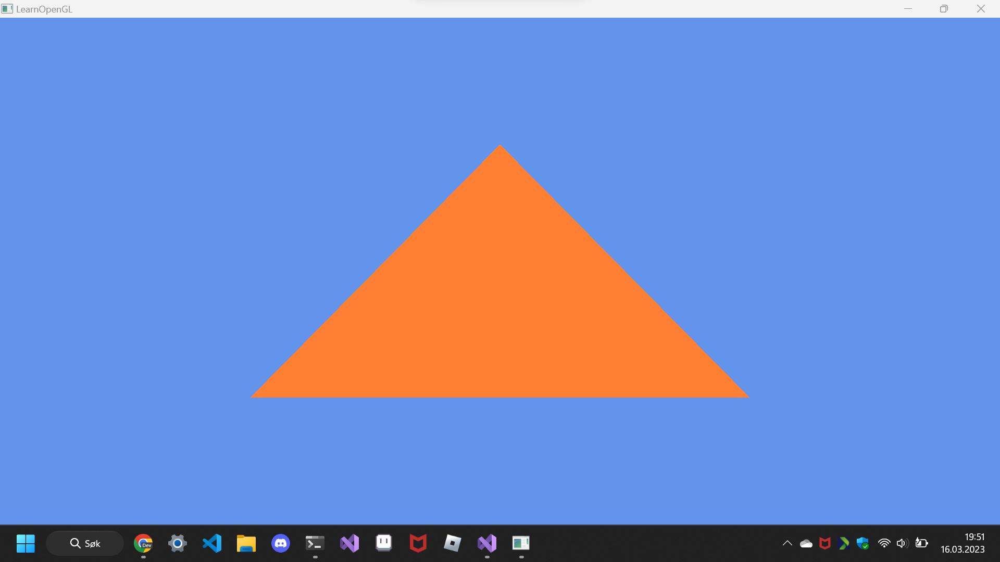
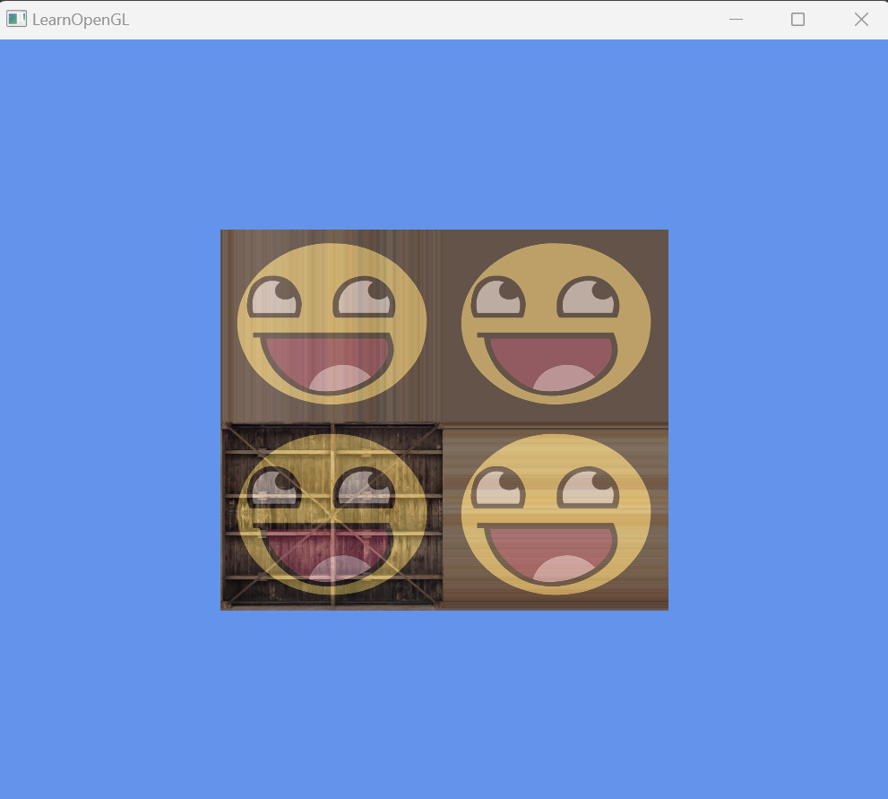

# opengl

https://github.com/nikeedev/opengl/assets/69197950/bcbc36bf-3091-4793-a5d3-0c714adf92ed

https://github.com/nikeedev/opengl/assets/69197950/c95c4c67-1fac-4cdd-b6e6-65ebcc7f61c8

https://github.com/nikeedev/opengl/assets/69197950/3ba33da4-33ea-4d85-bc2b-69a8e137cbb2

